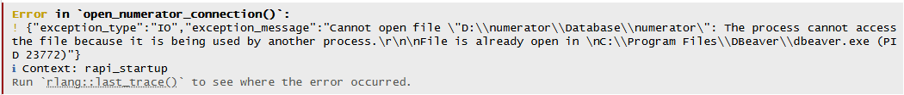
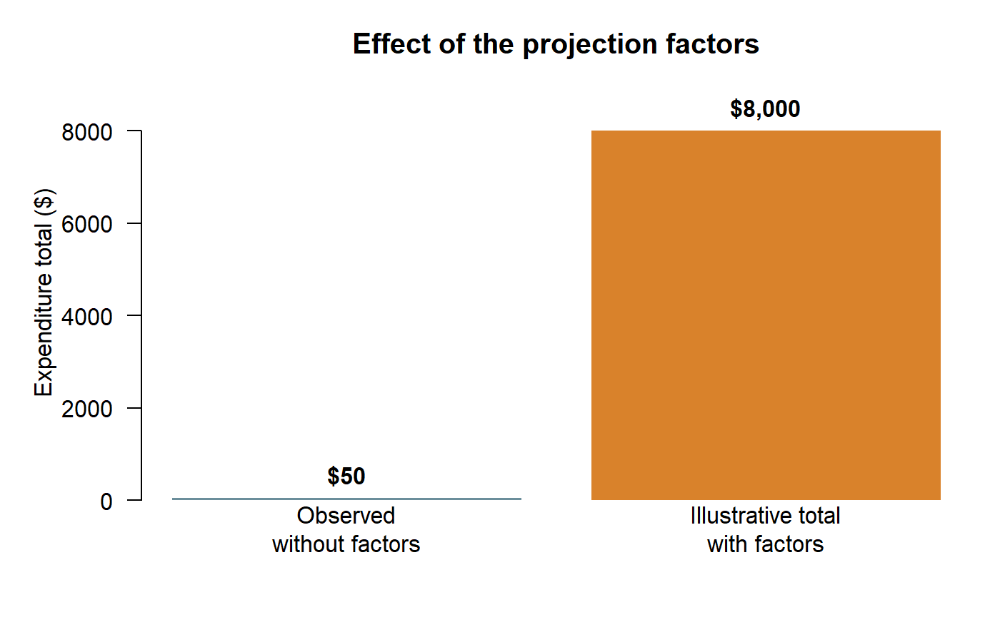

## Today’s goals

We will spend the first **30 minutes** sharing project updates, questions, and current obstacles. We will use the remaining **hour** to cover:

- how to read the Numerator entity-relationship diagram;
- how the Numerator database, schemas, and Parquet source files are organized;
- why we use DuckDB and how R connects to it;
- how the household, basket, banner, and static weighting tables relate;
- how to interpret static-household definitions and gaps in weighting-file coverage;
- how the available projection factors are intended to be used; and
- how to begin the sample-flow diagnostics in R.

By the end of the lab, you should be able to connect R to the Numerator DuckDB database on Orchard, inspect the available tables, retrieve a household- or basket-level result, and close the connection. We will begin at the **household and basket level**; product-level work comes later.

## Files for this lab

The following files will be available in the designated lab folder on Orchard. Copy them into your own R project before you begin. They are not distributed through the public website or GitHub repository.

- `config.R`: open and close a read-only connection.
- `read_numerator.R`: inspect columns and retrieve a small extract.
- `example_script.R`: walk through the first connection, table previews, and SQL queries.

## 1. Reading an ER diagram

An **entity-relationship (ER) diagram** is a visual map of a database. Each box represents a table, the entries inside the box are its columns, and the lines show how tables can be connected. ER diagrams are useful because they help you find the variables you need, identify the columns used to join tables, and see whether a relationship is one-to-one or one-to-many before you write code.

When reading an ER diagram:

1. Find the table that contains the outcome or observation you want to study.
2. Read its column names and identify its ID fields.
3. Follow a connecting line to see which ID links it to another table.
4. Read the symbols at the ends of the line. A `1` means one matching record; a `*` means that several records may match.
5. Ask what one row represents in each table. For example, one row may represent a household, a shopping basket, or an item within a basket.

We will walk through the supplied Numerator ER diagram together and use the example below to connect it to the tables we will use in R.

### Example: Explain how these tables are related

| Table | Grain and purpose | Key fields |
|---|---|---|
| `people_table` | Demographics table | `user_id`, `postal_code`, and other fields |
| `banner_table` | Retailer information table | `banner_id`, `banner`, `channel`, `parent_channel`, and other fields |
| `summarylvl_fact_table` | Summary level transaction table | `basket_id`, `user_id`, `banner_id`, `transaction_date`, spending and other fields |

#### `people_table`

- `user_id` = unique household id
- `postal_code` = household's current home postal code

> Note: For historical residence, the dictionary describes `people_history_table.FROM_DATE` and `UNTIL_DATE` as **demographic validity dates**, not enrollment dates. We will need a validated time-varying join for that work.

#### `banner_table`

- `banner_id` = identifier used to connect a transaction to a retailer banner
- `banner` = retailer banner name
- `retailer` = retailer name
- `channel` and `parent_channel` = retail channel classifications

#### `summarylvl_fact_table`

- `basket_id` = internal id that designates a unique trip
- `basket_total` = receipt total
- `basket_sub_total` = pre-tax subtotal
- `basket_adjusted_subtotal` = basket subtotal after discounts and adjustments are applied
- `store_postal_code` = postal code of the store location (where available)
- `store_longitude` = longitude coordinate of the store location (where available)
- `store_latitude` = latitude coordinate of the store location (where available)
- `order_method_type` = method used to place the order (e.g., in-store, online, app)
- `order_provider` = platform or service through which the order was placed (e.g., retailer app, third-party marketplace)
- `delivery_method_type` = method used to deliver the order (e.g., home delivery, curbside pickup, in-store pickup)
- `delivery_provider` = third-party or retailer service that fulfilled the delivery (e.g., Instacart, DoorDash)
- `order_delivery_type` = combined classification of the order and delivery method (e.g., BOPIS, ship-to-home, delivery)

> Note: A store basket is not necessarily all food. Additional field descriptions are available on the server in the `MASTER Numerator Data Dictionary.xlsx` file.

:::{.callout-note title="On Your Own"}
Describe how you would join the three tables. Before joining, check what relationship the tables have. Are they one-to-one? One-to-many? Many-to-many?
:::

### Database structure

Numerator delivers the source data as **Parquet files**. Parquet is a compressed, column-based file format designed for large analytical datasets. The current release is stored in table-specific folders under `D:\numerator\2026_07\`, and it includes retail purchases from **1-1-2018 through 6-30-2026**. Keeping the vendor files in their original format gives us an unchanged source copy and lets DuckDB read only the columns and rows needed for a query.

The DuckDB database is stored at:

```text
D:\numerator\Database\numerator
```

The database organizes its objects into **schemas**. A schema is a named section of a database, similar to a folder. It keeps tables with different purposes separate and allows two schemas to contain tables with the same name. In SQL and R, we identify a table with `schema_name.table_name`, such as `core_new.people_table`.

Our main schemas are:

| Schema | Purpose |
|---|---|
| `core_new` | Current Numerator delivery. Its tables are views over the Parquet source files. Use this schema for the vendor tables in this lab. |
| `core` | Earlier Numerator delivery retained for comparison. Do not use it unless a project specifically requires that release. |
| `reference` | Shared classifications, crosswalks, and household reference tables that can be reused across projects. |
| `diagnostics` | Reproducible checks and summaries built from the source data. |

We keep shared reference tables in their own schema because some definitions require substantial setup and should be consistent across projects. For example, each student should not independently rebuild retailer-channel classifications. A maintained table in `reference` can be created once, checked, and then read by many people. **Transaction tables** record purchases; **reference tables** describe, classify, or summarize the records used in those analyses.

### Why DuckDB?

DuckDB is designed for analytical queries over large files. It can query Parquet directly, perform joins and summaries before data enter R, and return only the smaller result that you need. The full transaction tables are too large to load into R at once. DuckDB is also embedded: R opens the database file directly through the `DBI` package, so you can work from RStudio without running a separate database server. We use read-only connections so several people can query the shared database without changing its source tables.

### Sample of tables in the Numerator schemas

The current vendor tables in `core_new` are:

| Table | What one row represents | Main contents |
|---|---|---|
| `core_new.banner_table` | One retailer banner | Retailer, banner, channel, and parent channel |
| `core_new.item_table` | One catalog item | UPC/GTIN, brand, manufacturer, and product hierarchy |
| `core_new.itemlvl_fact_table` | One purchased item within a basket | Item quantity, price, spending, transaction date, and item-level factors |
| `core_new.summarylvl_fact_table` | One basket or trip | Basket spending, transaction date, store geography, ordering, delivery, and basket factors |
| `core_new.people_table` | One current household record | Current household demographics and home geography |
| `core_new.people_history_table` | One household demographic period | Time-varying demographics with validity dates |
| `core_new.people_attributes_table` | One household attribute or tag | Themes, topics, tags, and tag dates |
| `core_new.static_table` | One household weighting window | Static-file dates and household weighting fields |
| `core_new.numerator_variable_metadata` | One documented column | Table names, column names, positions, and data types |

The database also contains shared `reference` objects. These tables will be helpful for all students looking to understand the scope of data covered.

| Table or view | Purpose |
|---|---|
| `reference.dept_category` | Distinct Numerator department and category hierarchy |
| `reference.channel_fah_fafh_mapping` | Shared parent-channel and channel classifications |
| `reference.ecommerce_retailer_mapping` | Retailer-level classifications for e-commerce banners |
| `reference.numerator_channel_type` | Banner-level channel classification built from the shared mappings |

The database may gain tables as it is updated.

## 2. Connecting R to DuckDB

Run R/RStudio inside your Orchard session. R connects directly to `D:\numerator\Database\numerator`. The database file has no extension, and its views depend on Parquet files stored elsewhere on Orchard, so copying only the database file to another computer is not enough.

Install the packages once into your own R library:

```r
install.packages(c("DBI", "duckdb"))
```

You only need to install these packages once. At the start of a work session, begin with four steps: load the connection instructions, open the database, run a query, and close the database.

### A first query

Run this example one section at a time rather than running the entire script at once.

```r
# 1. Load the connection instructions.
source("config.R")

# 2. Open a read-only connection to the shared DuckDB database.
con <- open_numerator_connection()

# 3. Ask DuckDB for five household records.
households <- DBI::dbGetQuery(con, "
  SELECT user_id, postal_code, census_region_name
  FROM core_new.people_table
  LIMIT 5
")

# Look at the data frame that DuckDB returned to R.
View(households)

# 4. Close the connection as soon as the query is finished.
close_numerator_connection(con)
```

The text inside quotation marks is **SQL**. SQL is the language used to ask a database for information:

- `SELECT` names the columns to return.
- `FROM` names the schema and table containing those columns.
- `LIMIT 5` asks for only five rows.

`DBI::dbGetQuery()` sends that SQL from R to DuckDB. DuckDB does the database work and returns the result as an ordinary R data frame called `households`.

### Using the helper script

`read_numerator.R` contains shortcuts for common tasks. Source it after `config.R`:

```r
source("config.R")
source("read_numerator.R")

con <- open_numerator_connection()

available_tables <- list_numerator_tables(con)
people_columns <- describe_numerator(con, "people_table")
people_preview <- read_numerator(con, "people_table", limit = 10)

close_numerator_connection(con)
```

This produces three R data frames:

- `available_tables` lists the tables and schemas you can query;
- `people_columns` lists the columns in `people_table`; and
- `people_preview` contains ten example rows.

The functions in `read_numerator.R` protect long ID numbers by reading them as text and use lowercase column names in R. A preview shows you the table's structure; it is not a random or representative sample. Large transaction tables should be filtered or summarized by DuckDB before their results are brought into R.

::: {.callout-warning title="If the database will not open"}
The function `open_numerator_connection()` opens the database in read-only mode, so several R users can usually query it at the same time. If `con <- open_numerator_connection()` returns a message saying that the file is already in use by another process, someone likely has the shared database open in DBeaver with a read-write connection.

{fig-alt="An R error stating that the Numerator DuckDB file cannot be opened because it is already being used by DBeaver." width=95%}

Post a message in the **Teams channel** so the person using DBeaver knows that others are waiting. For example:

> I cannot connect to the Numerator database because the file appears to be locked by DBeaver. Is anyone using it now? Please close the DBeaver connection when you finish and let the channel know.

Keep notifications turned on for the Teams channel while you have the database open in DBeaver so you see these requests. Close the DBeaver connection as soon as you finish and post that the database is available again.

Always close an R connection as soon as your query finishes. If your code stops with an error after the connection opened, run `close_numerator_connection(con)` in the Console. A different error message may instead indicate a missing package, an incorrect path, or another setup problem.
:::

::: {.callout-note collapse=true title="More advanced: close the connection automatically"}
After you are comfortable with the four basic steps, you can place them inside a function. `on.exit()` tells R to close the connection when the function ends, including when a query produces an error.

```r
count_households_by_month <- function() {
  con <- open_numerator_connection()
  on.exit(close_numerator_connection(con), add = TRUE)

  DBI::dbGetQuery(con, "
    SELECT date_trunc('month', transaction_date)::DATE AS month,
           COUNT(DISTINCT user_id) AS n_households
    FROM core_new.summarylvl_fact_table
    WHERE transaction_date >= DATE '2025-01-01'
      AND transaction_date < DATE '2026-01-01'
    GROUP BY month
    ORDER BY month
  ")
}

monthly_households <- count_households_by_month()
```

This version follows the same sequence as the first example. Here you are creating a summary table that counts the number of distinct households that appear in the basket-level table by month from 1/1/25 to 1/1/26.
:::

## 3. Static households and weighting-file coverage

Households join and leave consumer panels at different times, and they do not all submit receipts consistently. This creates a problem for research over time: a decline in purchases could mean that a household stopped buying something, or it could mean that the household stopped reporting purchases. A **static household** sample attempts to identify households with sufficiently consistent reporting for comparisons over time.

“Static” does **not** mean that the household's demographics never change or that it participates forever. It refers to reporting consistency during a defined period.

### Numerator's official definition

The documentation supplied with the data describes Numerator's official Omnipanel static sample as households meeting all of these conditions:

- 12 consecutive calendar months of reporting paper receipts in **FMCG (fast-moving consumer goods)** channels, which cover frequently purchased products sold through grocery, mass-market, drug, convenience, and related retailers;
- gas-only receipts excluded;
- demographic and geographic representation requirements; and
- at least 95% of receipts fully transcribed.

Numerator caps that official panel at approximately 100,000 households nationally. The files on Orchard do not contain a field that clearly identifies which households belong to that official panel.

Numerator supplies `core_new.static_table`, but the table does not identify the approximately 100,000 households in the official Omnipanel static sample. It contains a much larger set of households and repeated records used for weighting. We therefore treat it as a **monthly weighting file**, not as a ready-made static-household list.

::: {.callout-important title="A project's static sample must match its research question"}
There is no shared `reference.static_households` or `reference.static_household_spells` table for this lab. A project studying annual spending, long-run changes, or responses to a specific event may need different continuity rules. Define the required observation period and reporting criteria for the research question, document those choices, and then create the project's analytic sample.
:::

### How `core_new.static_table` represents time

In `core_new.static_table`, each row describes one household and one **12-calendar-month weighting window**. `START_DATE` is the beginning of that window, and `END_DATE` is the end. Numerator refreshes these records monthly, so adjacent rows for the same household normally overlap for 11 months.

For example:

| `START_DATE` | `END_DATE` | How to read the row |
|---|---|---|
| 2024-02-01 | 2025-01-31 | Weighting window ending in January 2025 |
| 2024-03-01 | 2025-02-28 | Weighting window ending in February 2025 |
| 2024-04-01 | 2025-03-31 | Weighting window ending in March 2025 |

These are three monthly weighting records. They are not three separate participation periods, and the first `START_DATE` and last `END_DATE` are not verified panel entry and exit dates.

When studying the sequence of records in this table, use the **month of `END_DATE`** as the label for each monthly weighting record. If a household has `END_DATE` months of January, February, March, June, and July, then its observed weighting-file coverage has two runs:

| Observed run | First `END_DATE` month | Last `END_DATE` month | Observed months | Gap before run |
|---|---|---|---:|---:|
| 1 | January | March | 3 | 0 |
| 2 | June | July | 2 | 2 months |

April and May are absent from that household's weighting records. This tells us that the household was missing from those monthly weighting files. It does **not** prove that the household left the panel, stopped submitting receipts, or stopped purchasing. For that reason, call these **observed weighting-file coverage runs**, rather than confirmed participation spells.

::: {.callout-warning title="`END_DATE` is a weighting endpoint, not a panel exit date"}
Use `END_DATE` to order and label the monthly records in `core_new.static_table`. Do not interpret it as the date a household left Numerator. The available files do not yet provide verified panel entry and exit dates.
:::

## 4. Projection factors and expenditure comparisons

Numerator is an opt-in panel, not a census of every US household or every purchase. Some types of households and purchases are more common in the panel than others. A **projection factor** is a multiplier supplied with the data to scale an observed record toward a larger target population.

A factor of 100 means that the record contributes 100 units to a projected calculation. It does not mean that the observed household literally made 100 identical purchases. The factor changes how much influence the record has in the estimate.

The fields answer different weighting questions. The supplied dictionary describes their intended roles:

| Field | Table | Intended role |
|---|---|---|
| `ER_FACTOR` | `itemlvl_fact_table` | Projects an item-level purchase beyond the observed panel to a broader population |
| `BASKET_ER_FACTOR` | `summarylvl_fact_table` | Projects a basket-level purchase beyond the observed panel to a broader population |
| `TREND_FACTOR` / `BASKET_TREND_FACTOR` | Corresponding fact table | Trend-adjusted projection at the item or basket level |
| `DEMO_WEIGHT` | `static_table` | Adjusts household contributions so the weighting sample represents the demographic composition of the US population |
| `NATIONAL_FACTOR` | `static_table` | Scales panel activity toward national purchase estimates |

`ER_FACTOR` and `BASKET_ER_FACTOR` are attached directly to purchase rows. Use the item-level field for an item-level outcome and the basket-level field for a basket-level outcome. `DEMO_WEIGHT` and `NATIONAL_FACTOR` are attached to a household's 12-month weighting record in `core_new.static_table`. `DEMO_WEIGHT` addresses demographic representation. `NATIONAL_FACTOR` is also concerned with purchase activity and national scaling; it is not simply another demographic weight.

This means the proposed distinction is only partly correct: the ER factors are purchase-level projection factors, and `DEMO_WEIGHT` is the demographic household weight. `NATIONAL_FACTOR` belongs with the household weighting records, but its documented purpose is to project panel activity to national purchase estimates. Do not treat `DEMO_WEIGHT` and `NATIONAL_FACTOR` as interchangeable, and do not multiply factor families together unless Numerator's methodology confirms the correct estimator and date alignment.

::: {.callout-warning title="What we do not yet know"}
We do not yet have documentation explaining how Numerator constructs these factors, including their calibration targets, normalization, trimming, eligible population, or how the factor families relate. The field descriptions tell us what each variable is intended to do, but they do not tell us whether factors should be combined or how a household weighting window should be matched to individual purchases. Until that methodology is confirmed, treat the calculations below as demonstrations of weighted arithmetic rather than certified national estimates.
:::

Use the outcome and the table's grain to decide where to begin:

| Question | Field to investigate first | Reason |
|---|---|---|
| What do the observed baskets represent at a broader population level? | `BASKET_ER_FACTOR` | It is stored on each basket row. |
| What do the observed item purchases represent at a broader population level? | `ER_FACTOR` | It is stored on each item-purchase row. |
| How should households contribute when describing national demographic composition? | `DEMO_WEIGHT` | It adjusts household representation. |
| How should the weighted household panel's activity scale to national purchase estimates? | `NATIONAL_FACTOR` | This is its documented role, but the calculation and time alignment still need confirmation. |

### A step-by-step example

Suppose we observe two baskets:

| Basket | Observed expenditure | `BASKET_ER_FACTOR` | Expenditure × factor |
|---|---:|---:|---:|
| A | $20 | 100 | $2,000 |
| B | $30 | 200 | $6,000 |

**Step 1: Calculate the observed total.**

The two recorded baskets contain $20 + $30 = **$50** in observed expenditure.

**Step 2: Multiply each basket by its factor.**

- Basket A: $20 × 100 = $2,000
- Basket B: $30 × 200 = $6,000

**Step 3: Add the projected contributions.**

$2,000 + $6,000 = **$8,000**. Under the assumption that `BASKET_ER_FACTOR` is the appropriate standalone multiplier, this is the illustrative projected expenditure total for these records.

In notation, the same calculation is:

$$
\widehat{E}_t = \sum_{b \in \mathcal{B}_t} E_b\,w_b,
\qquad w_b = \text{BASKET\_ER\_FACTOR}_b.
$$

**Step 4: Distinguish a projected total from a weighted mean.**

The sum of the factors is 100 + 200 = 300. Dividing $8,000 by 300 gives **$26.67**, the weighted mean expenditure per basket in this example. It is not total national expenditure, annual household expenditure, or expenditure per household. Those are different outcomes with different denominators.

### Reproducing the example in R

The following R code creates the same two fictional baskets and repeats each step of the calculation. This example does not connect to DuckDB; its purpose is to make the arithmetic visible before applying it to the full data.

```r
basket_example <- data.frame(
  basket = c("A", "B"),
  basket_total = c(20, 30),
  basket_er_factor = c(100, 200)
)

# Multiply each basket's expenditure by its factor.
basket_example$projected_contribution <-
  basket_example$basket_total * basket_example$basket_er_factor

# Add the observed expenditures: 20 + 30 = 50.
observed_total <- sum(basket_example$basket_total)

# Add the projected contributions: 2,000 + 6,000 = 8,000.
projected_total <- sum(basket_example$projected_contribution)

# Divide projected expenditure by the sum of the factors.
weighted_mean <- projected_total / sum(basket_example$basket_er_factor)

basket_example
observed_total
projected_total
weighted_mean
```

The four results should match the hand calculation above: $50 observed, $8,000 projected, and a $26.67 weighted mean. The figure compares the two totals. The weighted bar is much taller because the factors scale the two observed baskets toward a larger population.

{fig-alt="A bar chart comparing 50 dollars observed without projection factors with 8,000 dollars after applying the illustrative basket projection factors." width=85%}

::: {.callout-note collapse=true title="More advanced: apply the calculation to DuckDB"}
Once the arithmetic is clear, the same calculation can be placed inside a SQL query and sent from R to DuckDB. This query summarizes January 2025 baskets without loading every basket into R. It also counts records with missing spending or unusable factors so that those records are not silently ignored.

```r
source("config.R")
con <- open_numerator_connection()

projection_example <- DBI::dbGetQuery(con, "
  SELECT
      COUNT(*) AS n_baskets,
      COUNT(*) FILTER (WHERE basket_total IS NULL) AS missing_spending,
      COUNT(*) FILTER (
          WHERE basket_er_factor IS NULL
             OR NOT isfinite(basket_er_factor)
             OR basket_er_factor <= 0
      ) AS unusable_factors,
      SUM(basket_total) FILTER (
          WHERE basket_total IS NOT NULL
            AND basket_er_factor IS NOT NULL
            AND isfinite(basket_er_factor)
            AND basket_er_factor > 0
      ) AS observed_spending_for_usable_records,
      SUM(basket_total * basket_er_factor) FILTER (
          WHERE basket_total IS NOT NULL
            AND basket_er_factor IS NOT NULL
            AND isfinite(basket_er_factor)
            AND basket_er_factor > 0
      ) AS illustrative_projected_spending
  FROM core_new.summarylvl_fact_table
  WHERE transaction_date >= DATE '2025-01-01'
    AND transaction_date < DATE '2025-02-01'
")

close_numerator_connection(con)
View(projection_example)
```

Check `missing_spending` and `unusable_factors` before interpreting the factor-adjusted columns. Do not replace a missing factor with 1.
:::

The database example uses all January 2025 basket records and is meant to show the mechanics of the calculation. Restricting the data to a project-defined static sample, selected ZIP codes, channels, or continuously observed households changes the sample, and the supplied factors may not project that restricted sample nationally.

When comparing an estimate with a national benchmark, make sure the time period, population, retail channels, tax treatment, and definition of expenditure match. Always report the observed sample size and unweighted expenditure alongside a factor-adjusted result. Weighting does not by itself fix missing geographic coverage, household attrition, or a mismatch between the panel outcome and the benchmark.

## 5. Homework: your first database workflow in R

The goal for this assignment is to practice the complete workflow once:

**connect to DuckDB → inspect tables → read a preview → run SQL from R → close the connection.**

### Part 1: Run the example script

1. Locate `config.R`, `read_numerator.R`, and `example_script.R` in your project folder on Orchard.
2. Open `example_script.R` in RStudio.
3. Run the script **one section at a time** with Ctrl+Enter. Read the comments before running each section.
4. Stop after each `View()` command and look at the returned R data frame.
5. Confirm that the final section closes the connection.

The script creates these objects:

| R object | What it shows |
|---|---|
| `available_tables` | Tables and schemas available in the database |
| `people_columns` and `basket_columns` | Column names and data types |
| `people_preview`, `static_preview`, and `basket_preview` | Ten example rows from three tables |
| `sample_flow` | All 2025 basket households → households matched to `people_table` → matched households with a postal code |
| `monthly_coverage` | Observed households and baskets for each month of 2025 |

Answer these questions:

1. Which schema contains `people_table`, `summarylvl_fact_table`, and `static_table`?
2. Which IDs connect the household, banner, and basket tables?
3. How many households are retained at each row of `sample_flow`?
4. How many households do not match a current record in `people_table`? How many more are lost when a nonblank postal code is required?
5. Which month has the largest number of observed households in `monthly_coverage`?

### Part 2: Run your own SQL query from R

Create a new R script. Use the same four basic steps from the lab notes: source `config.R`, open the connection, run the query below, and close the connection.

```r
source("config.R")
con <- open_numerator_connection()

households_by_region <- DBI::dbGetQuery(con, "
  SELECT
      census_region_name,
      COUNT(*) AS n_household_records
  FROM core_new.people_table
  GROUP BY census_region_name
  ORDER BY n_household_records DESC
")

close_numerator_connection(con)
View(households_by_region)
```

In two or three sentences, explain what the SQL query asks DuckDB to do. Identify what `SELECT`, `FROM`, `GROUP BY`, and `ORDER BY` contribute to the result.

### What to bring to the next lab

Bring your completed R scripts, the `sample_flow` result, the `households_by_region` result, and your written answers. Also bring any error messages you encountered and a note describing how you resolved them. Keep all household extracts and detailed geographic outputs on Orchard or other approved lab storage.

## Questions to resolve before final estimates

The live DuckDB schema is the authority for the tables and column types currently available on Orchard. The supplied data dictionary describes the variables, but several methodological questions remain open. Before using these data for final estimates, we still need to confirm:

- whether an official Numerator static-panel flag is available;
- how to interpret months when a household is absent from the weighting file;
- whether any available dates represent actual panel enrollment and exit;
- how household weights should be aligned with transaction dates; and
- how Numerator constructs and intends researchers to combine the projection factors.

Any future static-household or coverage-run reference table should record its project-specific definition and can be revised when additional documentation becomes available.
