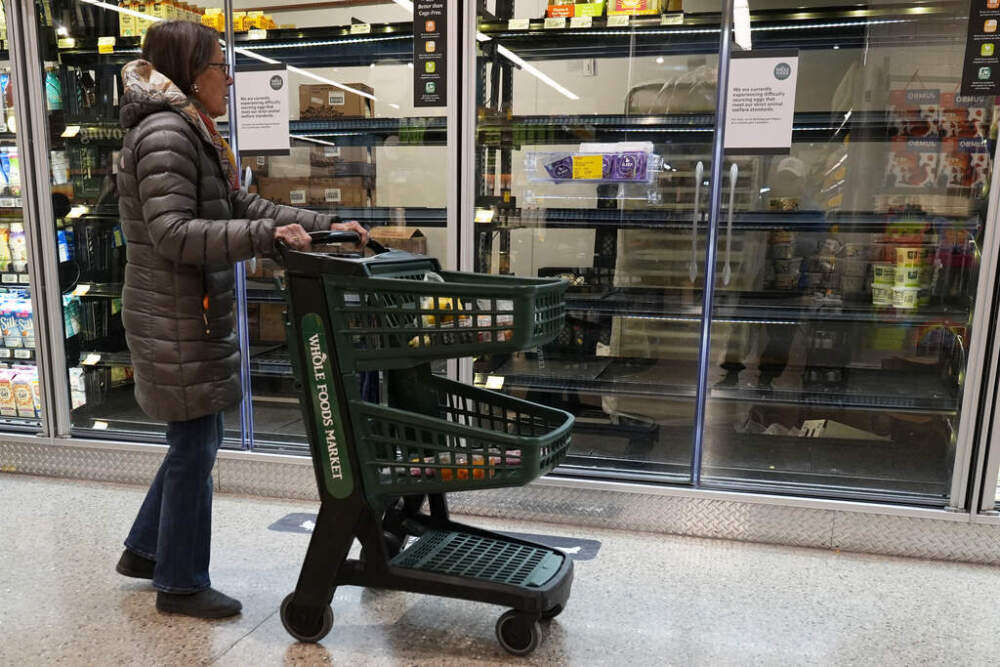
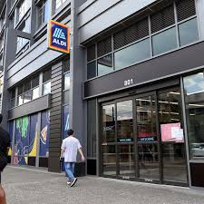
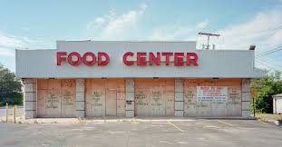
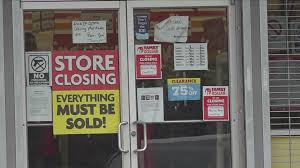
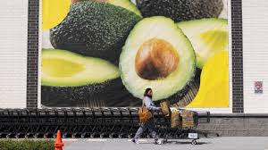
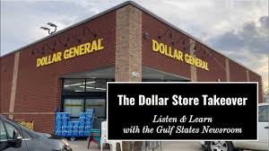
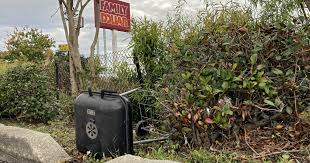

## Featured media

::: {.grid}

::: {.g-col-12 .g-col-md-6 .g-col-lg-4}
[{fig-alt="On Point story thumbnail"}](https://www.wbur.org/onpoint/2025/04/08/how-groceries-priced-pandemic-inflation)

### [How groceries are priced](https://www.wbur.org/onpoint/2025/04/08/how-groceries-priced-pandemic-inflation)

*On Point, WBUR / NPR, 2025*  
A conversation about grocery prices, inflation, and how pricing works across the food system.
:::

::: {.g-col-12 .g-col-md-6 .g-col-lg-4}
[{fig-alt="Denver Post story thumbnail"}](#)

### [Coloradans put ALDI at the top of their grocery list. Will their wish come true?](#)

*The Denver Post, 2025*  
Coverage of grocery retail expansion and consumer interest in ALDI entering Colorado.
:::

::: {.g-col-12 .g-col-md-6 .g-col-lg-4}
[{fig-alt="The Atlantic story thumbnail"}](https://www.theatlantic.com/sponsored/dollar-general-2025/expanding-food-access/3920/)

### [Expanding Food Access in America](https://www.theatlantic.com/sponsored/dollar-general-2025/expanding-food-access/3920/)

*The Atlantic, 2024*  
Discussion of food access, retail availability, and the role of stores in communities with limited food retail options.
:::

::: {.g-col-12 .g-col-md-6 .g-col-lg-4}
[{fig-alt="USA Today story thumbnail"}](#)

### [Dollar Stores Closing — What Does This Mean for Consumers?](#)

*USA Today, 2024*  
Commentary on dollar store closures and implications for consumers and communities.
:::

::: {.g-col-12 .g-col-md-6 .g-col-lg-4}
[{fig-alt="Wall Street Journal story thumbnail"}](#)

### [Supermarkets Are Losing This Food Fight](#)

*The Wall Street Journal, 2023*  
Coverage of competition between supermarkets and discount retail formats.
:::

::: {.g-col-12 .g-col-md-6 .g-col-lg-4}
[{fig-alt="NPR dollar store listening session thumbnail"}](https://www.wwno.org/news/2023-07-10/the-dollar-store-takeover-a-virtual-listening-session-and-conversation)

### [The Dollar Store Takeover: A Virtual Listening Session and Conversation](https://www.wwno.org/news/2023-07-10/the-dollar-store-takeover-a-virtual-listening-session-and-conversation)

*NPR / Gulf States Newsroom, 2023*  
A public conversation on the spread of dollar stores and implications for food access and local communities.
:::

::: {.g-col-12 .g-col-md-6 .g-col-lg-4}
[{fig-alt="NPR dollar store story thumbnail"}](https://www.wwno.org/business/2023-04-10/advocates-warn-of-a-dollar-store-invasion-researchers-are-still-figuring-out-the-consequences)

### [Advocates warn of a “dollar store invasion.” Researchers are still figuring out the consequences](https://www.wwno.org/business/2023-04-10/advocates-warn-of-a-dollar-store-invasion-researchers-are-still-figuring-out-the-consequences)

*NPR / Gulf States Newsroom, 2023*  
Reporting on dollar store expansion, food access, and ongoing research on community-level effects.
:::

::: {.g-col-12 .g-col-md-6 .g-col-lg-4}
[{fig-alt="MLive story thumbnail"}](#)

### [700 Michigan stores and counting — Why Dollar General is everywhere](#)

*MLive: Michigan Local News, 2023*  
Coverage of Dollar General expansion and what it means for local retail landscapes.
:::

::: {.g-col-12 .g-col-md-6 .g-col-lg-4}
[{fig-alt="JAMA Network story thumbnail"}](#)

### [Study Finds U.S. Households, Especially in Rural Areas, Increasingly Shop at Dollar Stores for Food](#)

*JAMA Network, 2023*  
Coverage of research on household food shopping at dollar stores.
:::

:::

